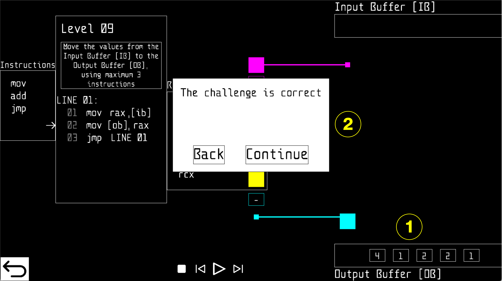

# Assembly Arquitect

**Assembly Arquitect** is an educational puzzle game designed to teach fundamental programming concepts through a visual and interactive interface inspired by low-level assembly language. The game challenges players to manipulate data using a minimal instruction set and register-based logic, fostering algorithmic thinking and a deeper understanding of computer architecture.

---

## 🧠 Concept Overview

Assembly Arquitect simulates a simplified assembly-like environment where players must solve increasingly complex tasks by writing code that manipulates data between an **Input Buffer (IB)** and an **Output Buffer (OB)** using virtual registers and instructions.

The game is inspired by pedagogical principles from programming education and cognitive load theory, aiming to:
- Reinforce understanding of memory operations.
- Develop procedural thinking.
- Introduce core concepts of instruction cycles and control flow.

---

## 🎮 Gameplay Mechanics

Players are presented with a visual programming interface consisting of:

- **Instruction Set**: Limited to basic operations such as `mov`, `add`, and `jmp`.
- **Registers**: Virtual registers (`rax`, `rbx`, `rcx`) used to store and manipulate data.
- **Buffers**: 
  - **Input Buffer [IB]**: Source of data values.
  - **Output Buffer [OB]**: Destination for processed values.
- **Code Panel**: Where players drag and drop instructions to build their solution.
- **Execution Controls**: Step-through or run the program to test logic.

---

## 🖼️ Screenshots

### 🧩 Level Interface

*Level 09: Move values from IB to OB using a maximum of 3 instructions.*

---

### 🧠 Code Execution

*Player writes a loop using `mov` and `jmp` to transfer values from IB to OB.*

---

### ✅ Challenge Completed

*Successful execution of the program with correct output values.*

---

## 🔍 Example Solution

```asm
@1
@2 mov rax,[ib]
@3 mov [ob],rax
@4 jmp LINE 01
```

This loop continuously reads from the Input Buffer into register `rax`, writes the value to the Output Buffer, and jumps back to repeat the process.

---

## 📚 Educational Objectives

Assembly Arquitect is designed to support the following learning outcomes:

- Understand the role of registers and memory in computation.
- Practice control flow using jumps and loops.
- Develop debugging and problem-solving skills.
- Experience a simplified model of instruction execution.

---

## 🛠️ Installation

To run the game locally:

```bash
git clone https://github.com/yourusername/assembly-arquitect.git
cd assembly-arquitect
make
./assembly
```

> ⚠️ Currently the game only works in MacOS with the SDL2 Framework installed.

---

## 🤝 Contributing

We welcome contributions! Please open an issue or submit a pull request with improvements, bug fixes, or new levels.

---

## 📜 License

This project is licensed under the MIT License. See the [LICENSE](LICENSE) file for details.

---

